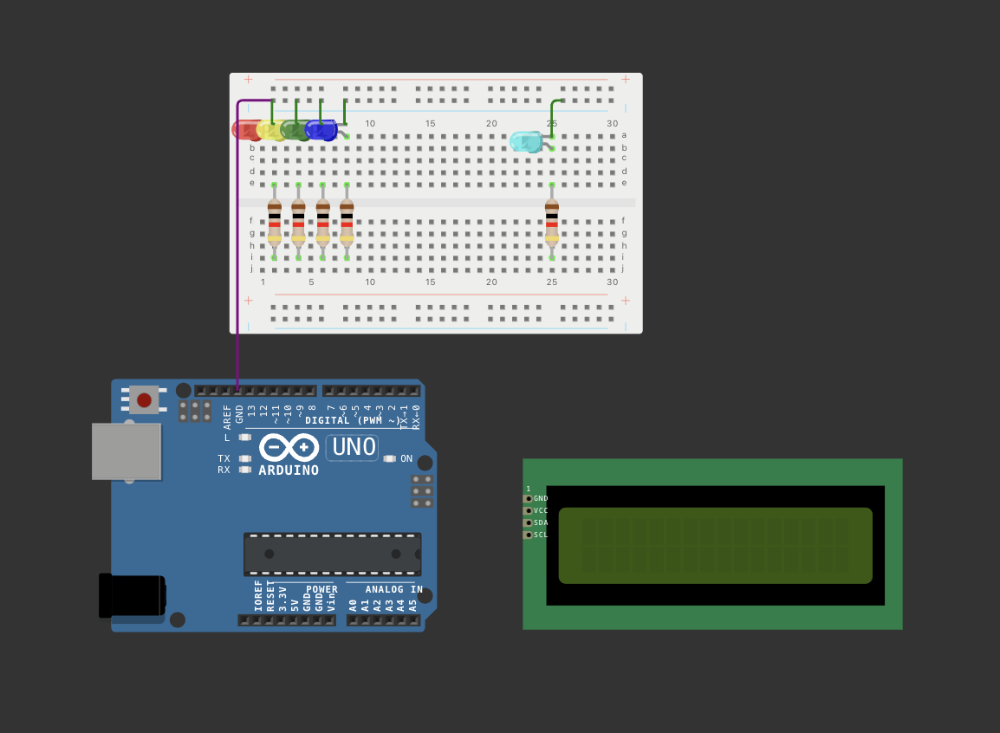
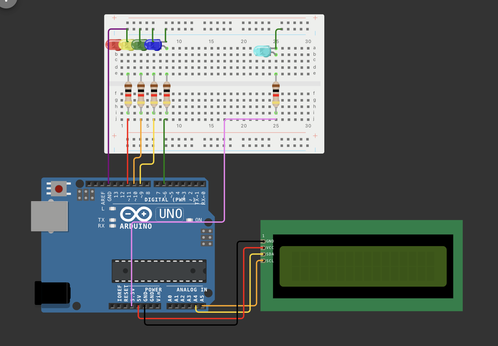

# exitgame: technische Dokumentation

> Wokwi-Projekt: [Link](https://wokwi.com/projects/401155421833016321)

## Aufbau / Rätsel

> **Hinweis**: Kabel an Display lassen.

## Aufbau / Lösung

> **Hinweis**: Die türkise Lampe (rechts) soll die Schwarzlicht-LED darstellen.

Alternativ kann die Diagram.json auch in ein [Wokwi.com](https://wokwi.com)-Projekt gekopiert werden.
